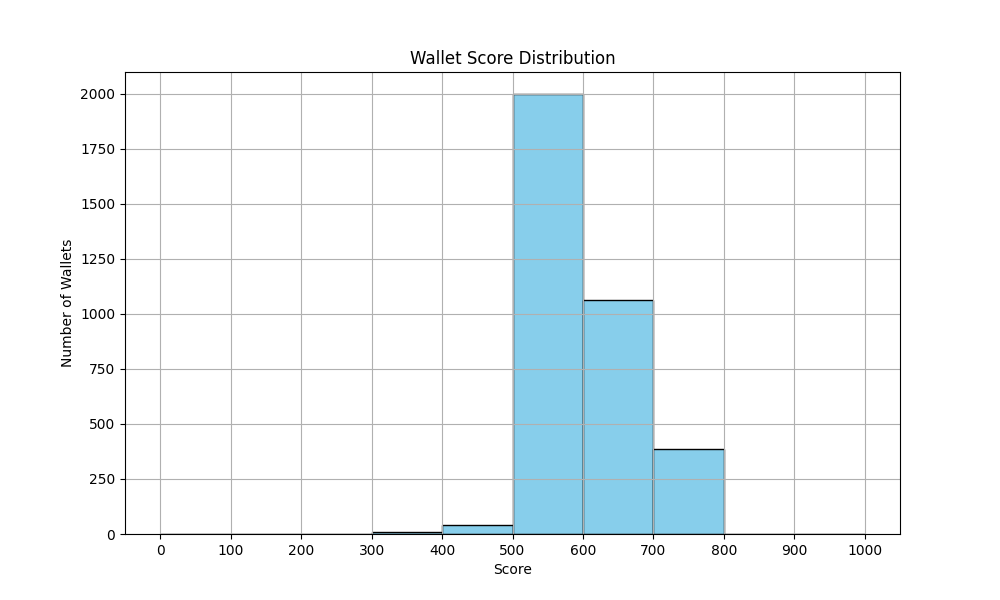

# Wallet Score Analysis

## High Score Behavior (900–1000)
- Consistent deposits and repayments
- High transaction frequency
- No liquidation events

## Low Score Behavior (0–200)
- No repayments
- Many liquidation events
- Infrequent or one-time usage

## Chart

